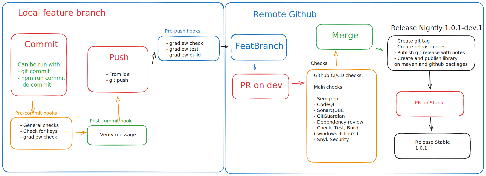
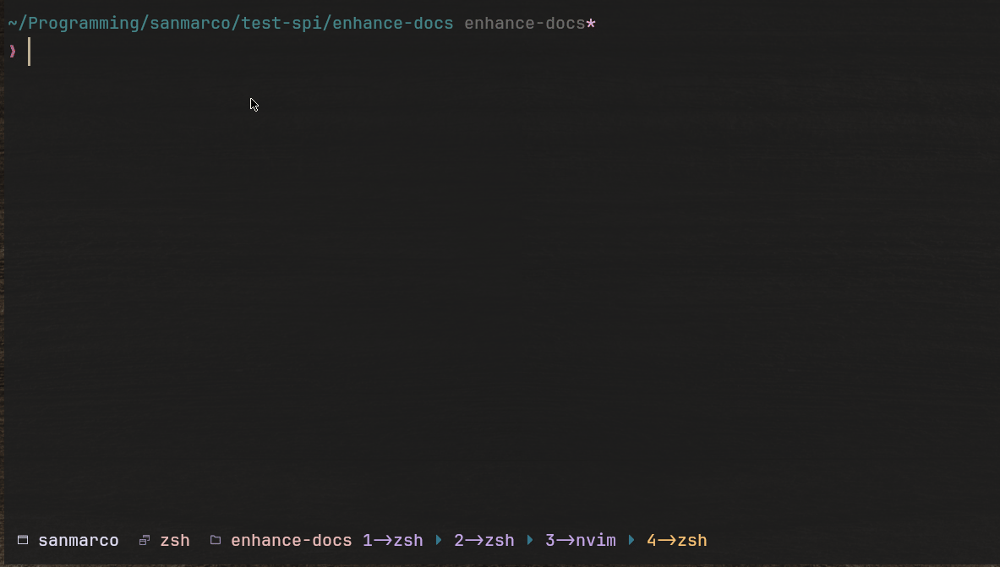
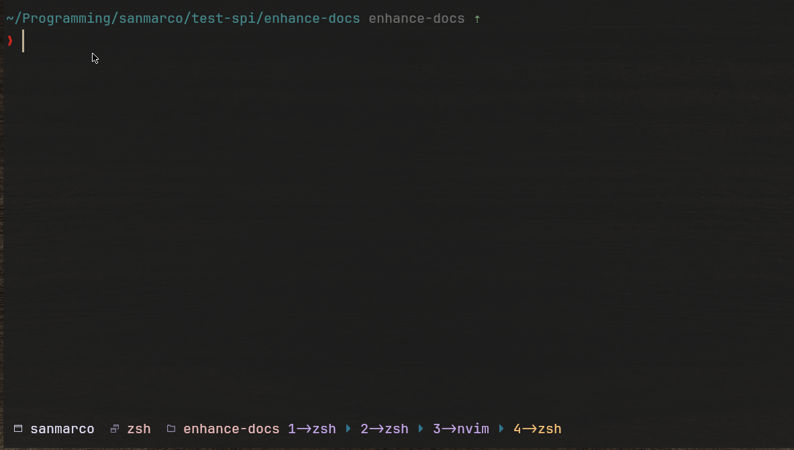

[](https://sonarcloud.io/summary/new_code?id=gipo999_test-spi)

[](https://github.com/gipo999/test-spi/actions/workflows/github-code-scanning/codeql)
[](https://github.com/gipo999/test-spi/actions/workflows/gradle-check-build.yml)
[](https://codecov.io/gh/gipo999/smispi)
[](https://github.com/gipo999/smispi/actions/workflows/publish.yml)

[](http://commitizen.github.io/cz-cli/)
[](https://github.com/semantic-release/semantic-release)
[](https://gist.github.com/cheerfulstoic/d107229326a01ff0f333a1d3476e068d)

# Smispi

<!--toc:start-->

- [Smispi](#test-spi)
  - [Introduction](#introduction)
    - [Flow](#flow)
    - [Pre-commit](#pre-commit)
    - [Pre-push](#pre-push)
    - [✅ **Pre-commit framework for git hooks**](#pre-commit-framework-for-git-hooks)
    - [✅ **Gradle tasks**](#gradle-tasks)
    - [✅ **GitHub Actions for CI/CD**](#github-actions-for-cicd)
    - [✅ **Github Apps for code quality and security**](#github-apps-for-code-quality-and-security)
    - [✅ **GitHub Pages for documentation**](#github-pages-for-documentation)
    - [✅ **GitHub Issues for tracking tasks and bugs**](#github-issues-for-tracking-tasks-and-bugs)
    - [✅ **GitHub Projects for tracking progress and manage agile development**](#github-projects-for-tracking-progress-and-manage-agile-development)
    - [✅ **GitHub Wiki for custom documentation**](#github-wiki-for-custom-documentation)
    - [✅ **GitHub Discussions for community engagement**](#github-discussions-for-community-engagement)
    - [✅ **GitHub Packages for artifact storage**](#github-packages-for-artifact-storage)
    - [✅ **GitHub Releases to publish the changelogs**](#github-releases-to-publish-the-changelogs)
  - [🧰 Required manual actions when cloning this repository](#🧰-required-manual-actions-when-cloning-this-repository)
    - [📎 Updating docs](#📎-updating-docs)
    - [⚙️ Updating the project settings](#️-updating-the-project-settings)
    - [🍏 Adding the github apps and registering them](#🍏-adding-the-github-apps-and-registering-them)
    - [🥷 Adding secrets](#🥷-adding-secrets)
    - [📄 Publishing on Maven](#📄-publishing-on-maven)
    - [🔎 Make sure static paths, names, and other things hardcoded in the project are updated to reflect the new project](#🔎-make-sure-static-paths-names-and-other-things-hardcoded-in-the-project-are-updated-to-reflect-the-new-project)
  - [REQUIREMENTS](#requirements)
  - [INSTALLATION](#installation)
  - [CONTRIBUTING](#contributing)
  - [SECURITY](#security)
  - [SUPPORT](#support)
  - [NOTES on creating this repo](#notes-on-creating-this-repo)
  <!--toc:end-->

👷 **Work in progress** 👷

## Introduction

This repository is a proof-of-concept for a fully automated CI/CD pipeline on a Java **library** using

- Local hooks
- GitHub Actions
- Semantic Release
- SemVer auto publishing

### Flow



### Pre-commit



### Pre-push



_small note on the pre-commit hook_

```text
It would be ideal to run the checks before running the prompt menu when running `npm run commit`.
In linux this is possible because we have access to `dev/tty` so we could intercept the message and modify it by replacing the terminal with the prompt and modify the current message.
In windows this is not possible.

The way the git hooks run is:

On commit action by user -> pre-commit hook runs -> write message (prepare-commit-msg hook, opens default editor to write if message is not specified via -m) -> commit-message hook runs -> commit.

When running `git commit` from the terminal, it correctly runs the pre-commit hooks first and the prompts for the commit message.

Running `npm run commit` is the equivalent of running `git commit -m "message" and the same happens when committing from the IDE`.

The important part is that the command `git commit` starts the commit process. The message can be prepared before or after it.
```

---

The code used for this test is a Java lib that uses the Service Provider Interface (SPI) pattern to load a service implementation at runtime.

It promotes collaboration using git and GitHub, with **multi-platform support** and it uses the following tools:

### ✅ **Pre-commit framework for git hooks**

Pre-commit will provide the following hooks:

- Pre-commit for detecting secrets

  Detect secrets with:

  - git-secrets
  - detect-secrets

- Pre-commit for code analysis

  It will notify the developer of styling and code issues and let them fix it.

  _Note that pre-commit is intentionally not formatting code
  as it is considered bad practice to change a commit intention._

  Npm command is provided as `npm run format` to run the gradle formatters

  Format code with:

  - spotless (many filetypes e.g. java, xml, groovy, json, toml, yaml, js, etc.)
  - openrewrite (fixes some checkstyle problems, can be configured to fix more adding more recipes)

- Pre-commit for basic actions

  Integrated pre-commit hooks like checking for file names cross platform compatibility, checking for trailing whitespaces, etc.

- Pre-commit-message for semantic versioning

  Adhering to the commitizen format for semantic versioning allows for automatic versioning, release and changelog generation.

  The project uses `cz-git` and `commitlint` using `cz-conventional-changelog` adapter for commitizen.

  An npm script is provided as `npm run commit` to run the commitizen cli with the cz-git adapter
  to prepare a correctly formatted commit message.

  A fix will increase the patch version, a feature will increase the minor version, and a breaking change will increase the major version.

- Pre-push for running tests

  Pre push hooks to make sure tests pass and the project is buildable before pushing to the remote.
  Note that gradlew build will run checks, tests and build the project.

### ✅ **Gradle tasks**

gradle will provide the following tools and tasks:

- Checkstyle for code style using google_checks configuration
- Sonarlint for static analysis
- Spotbugs for static analysis
- Spotless for code formatting and license headers (google_java_format)
- Openrewrite for code refactoring
- Test with JUnit
- Build tasks
- Deployment tasks

  _semgrep could be added here_

### ✅ **GitHub Actions for CI/CD**

GitHub Actions will provide the following workflows:

- Gradle Check, Test and Build on both windows and linux
- Semgrep for security analysis (github app)
- Semantic Release for automatic versioning and changelog generation

  Semantic Release will provide channels for different release types:

  - Stable on @main branch: 1.0.0
  - Beta on @beta branch 1.0.0-beta.0
  - Alpha on @alpha branch 1.0.0-alpha.0
  - Dev on @dev branch 1.0.0-dev.0
  - Next on @next branch 1.0.0-next.0 for preparing next release

- Code Scanning from github CodeQL
- Dependabot for dependency security analysis and alerts
- Renovate for dependency management (github app, reads dependabot alerts)
- Dependency review for dependency security analysis on PR if new dependencies are added
- GH pages publication of the docs/gh-pages folder
- Greeting action to welcome new contributors
- Labeler action to label issues and PRs with configurable labels
- Stale action to close stale issues and PRs
- Publish action to publish the artifact to GitHub Packages and/or maven on release

### ✅ **Github Apps for code quality and security**

Github apps are applications that can be installed on a GitHub repository to provide additional functionality.

GitHub Apps installed will provide the following tools:

- SonarCloud for code quality analysis
- Semgrep for security analysis
- Snyk for security analysis
- GitGuardian for secrets detection
- Renovate for dependency management, security vulns and auto updates

### ✅ **GitHub Pages for documentation**

Pages will publish folder docs/gh-pages and at the moment will provide the following documentation:

- Pitest report
- Javadocs

_it can be used to publish documentation with vite-press, docusaurus, mkdocs, etc._
_it can provide javadocs, pitest reports, swagger api, etc._

### ✅ **GitHub Issues for tracking tasks and bugs**

### ✅ **GitHub Projects for tracking progress and manage agile development**

### ✅ **GitHub Wiki for custom documentation**

### ✅ **GitHub Discussions for community engagement**

### ✅ **GitHub Packages for artifact storage**

### ✅ **GitHub Releases to publish the changelogs**

## 🧰 Required manual actions when cloning this repository

### 📎 Updating docs

- Update the README.md file with the project information
- Update the LICENSE file with the project license
- Update the .github/CODEOWNERS file with the project owners
- Update the .github/SECURITY.md file with the security policy
- Update the .github/SUPPORT.md file with the support policy
- Update the .github/CONTRIBUTING.md file with the contribution guidelines
- Update the .github/ISSUE_TEMPLATE/bug_report.md file with the bug report template
- Update the .github/ISSUE_TEMPLATE/feature_request.md file with the feature request template
- Update the .github/PULL_REQUEST_TEMPLATE.md file with the pull request template
- Remove useless files in the docs/ folder
- Customize the github pages in the docs/gh-pages folder

### ⚙️ Updating the project settings

- Project name, description
- Protection rules for tags and branches
- Security settings
- Dependabot settings
- enable CodeQL analysis

### 🍏 Adding the github apps and registering them

- SonarCloud
- GitGuardian
- semgrep
- Snyk
- Renovate

### 🥷 Adding secrets

This project is using semgrep which requires a secret to be added to the repository.

It also requires a github PAT to allow semantic-release action to create tags and releases since we are protecting the creation of those.

_Github secrets for actions_

- `PAT` with admin rights
- `SEMGREP_APP_TOKEN` from semgrep app
- `SNYK_TOKEN` from snyk app
- `CODECOV_TOKEN` for codecov

_check <https://central.sonatype.org/publish/publish-portal-gradle/> and <https://central.sonatype.com/>_

- `MAVEN_USERNAME` for publishing on maven
- `MAVEN_PASSWORD` for publishing on maven

_check <https://vanniktech.github.io/gradle-maven-publish-plugin/central/>_

- `GPG_PRIVATE` for signing the artifact (armored base64 encoded ascii format)
- `GPG_PASSWORD` for signing the artifact
- `GPG_PUBLIC` for signing the artifact

### 📄 Publishing on Maven

Publishing on mavenCentral requires approval from SonarType.
Please refer to the [Maven Central Repository](https://central.sonatype.org/publish/publish-guide/#introduction) for more information.

_to add maven `build.gradle` must be modified in the publishing property together with the github action `github-publish.yml`_

### 🔎 Make sure static paths, names, and other things hardcoded in the project are updated to reflect the new project

---

## REQUIREMENTS

- python `^3.9` as command `py` _(pre-commit framework, recommended installation with [scoop](https://scoop.sh/) in windows as it requires editing the registry to add py and scoop provides clear instructions after `scoop install python` on how to do it)_

```
Allow applications and third-party installers to find python by running:
"C:\Users\gipo1\scoop\apps\python\current\install-pep-514.reg"
```

- java `>= 8` installed _(required for running gradle pre-commit hooks which run in the cli)_
- node `^22` _(commitlint, cross-OS compatibility)_

## INSTALLATION

for collaborators

```console
git clone https://github.com/gipo999/smispi
cd test-spi
npm install
```

for externals

```console
fork the repository
git clone https://github.com/<your-username>/smispi
cd smispi
<optional> create a new branch
npm install
```

when you are ready to commit

```console
npm run commit
git push
open a PR
```

**⚠️ The below templates will have to be updated for a real project ⚠️**

## CONTRIBUTING

please follow the [CONTRIBUTING.md](.github/CONTRIBUTING.md) guidelines

## SECURITY

if you have a security related issue, please follow the [SECURITY.md](.github/SECURITY.md) guidelines

## SUPPORT

Please refer to the [SUPPORT.md](.github/SUPPORT.md) file

---

## NOTES on creating this repo

Additional notes taken while creating this repository can be found in the [NOTES.md](docs/general_notes.md) file
and in the folder [docs](docs/)

You can also check the branches `dev-bak*` and `husky` for previous iterations with comments
